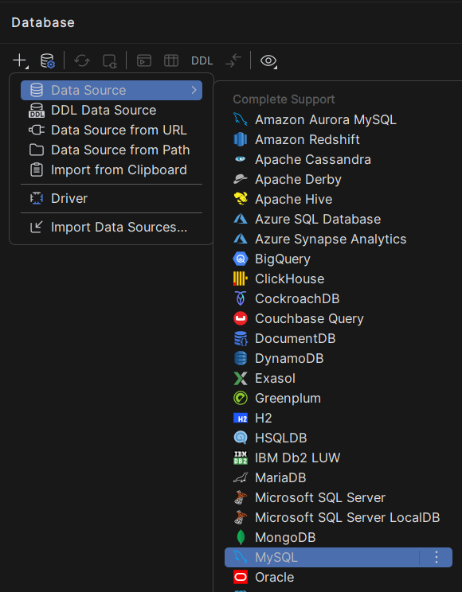
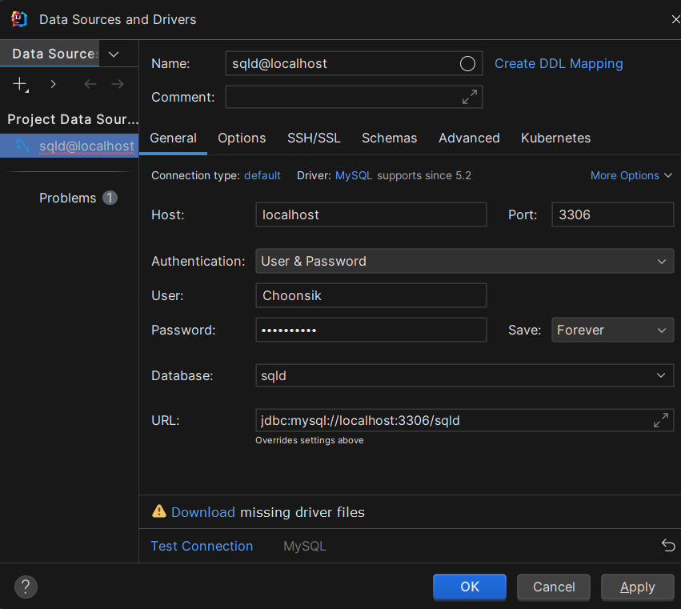
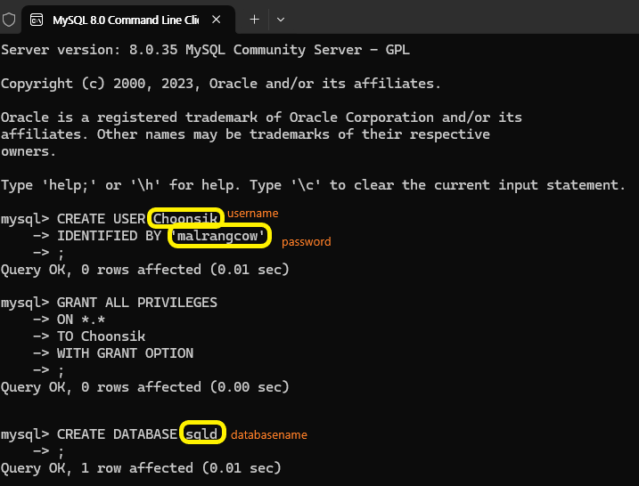

# INSTALLATIONS

```bash
# install ipython-sql
$ pip install ipython-sql

# install SQL server
$ pip install pyodbc

# install MySQL
$ pip install PyMySQL

# install PostgreSQL
$ pip install psycopg2

# caching_sha2_password
$ pip install cryptography
```


OR

```bash
$ pip install -r requirements.txt
```

and if you need to install pandas
```bash
$ pip install pandas
```

# Connect MySQL and IntelliJ IDEA
  
  
Downloaad the driver from the link below  

  
Open `MySQL Command Line Client` and enter the root password  

  
If you create a new DataBase, highly recommended to use lower case letters because some OS can't recognize the upper case letters.  

Back to the `DataBase Properties(IntelliJ IDEA)` and enter User info and new DataBase name to add a new data source


# Follow The GUIDE Below
### [Guide](/Guide.ipynb)

# INDEX
- Data Modeling
  - [Data Model](/Data-Modeling/Data-Model.md)
  - [Normalization](/Data-Modeling/Normalization.md)
  
- SQL Queries
  - [DCL](/SQL-Queries/DCL.ipynb)
  - [DDL](/SQL-Queries/DDL.ipynb)
  - [DML](/SQL-Queries/DML.ipynb)
  - [TCL](/SQL-Queries/TCL.ipynb)